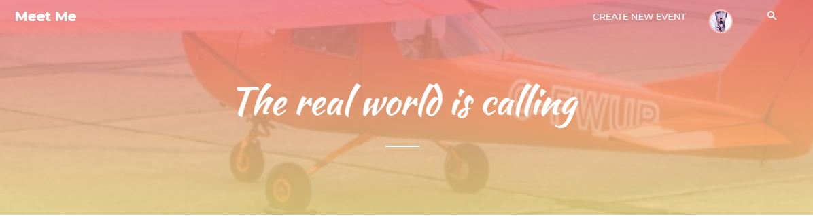

# Meet Me!
* M&M
* 02/06/2020 ~ 12/30/2019
----
**개발 목표**

    * 특정 주제를 공유하는 소모임을 위한 사이트

    * 소모임을 토대로 개인 블로그 운영 가능

**설계 주안점**

    * 블로그 내 게시판, 참석 이벤트, 방명록 제공
    
    * 해시태그 자동완성, 쪽지 기능, 알림 메세지, 타유저 팔로우 등 유저 편의 기능 제공

    * 이메일 인증, 비밀번호 암호화 등 보안 사용

    * 관리자 대시보드 내 사이트 활동 내역 통계 시각화, 신고 목록 관리 및 경고 메세지 발송 기능 제공
    
    * 이벤트 등록 및 열람 시 지도 제공 (Google API 사용)
    
    * 이벤트 참석 시 결제 가능 (결제 ## API 사용)

**개발 환경**

    * Eclipse Jee, STS, Oracle Database 11g, Tomcat 8.5, Spring Framework, Github
    
    * JAVA, HTML, JavaScript, jQuery, Bootstrap, 
   
